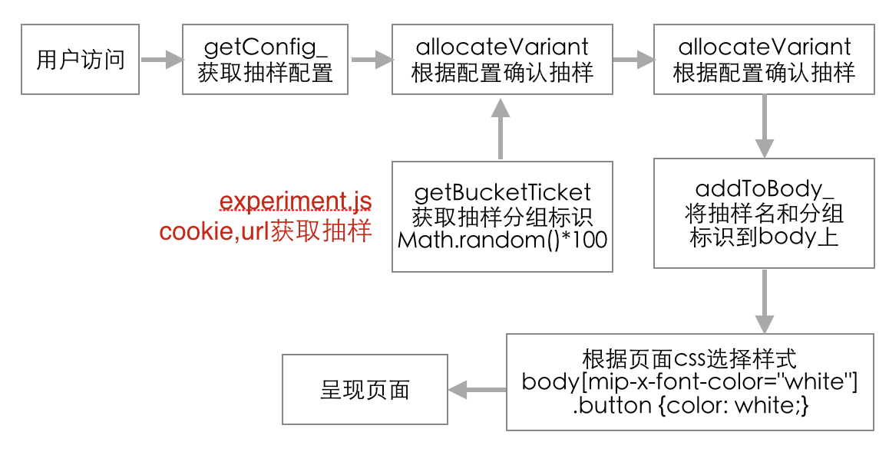

# Mip-experiment 设计文档

## 简介
mip-experiment是一个用于页面实验的组件。站长通过配置实验变量，达到展示不同页面内容样式的目的。支持通过url配置，强制显示某个实验效果。

## 技术依赖
- cookie：储存用户的抽样分组
- url读取：实现强制抽样
- 统计：百度统计

## 技术方案
1. 前端抽样分组：用户第一次访问页面时，为用户分组，储存在cookie中。多次访问时，从cookie中查看用户分组。
2. 前端标记，修改样式：为标记分组，给body加上`mip-x-name="groupA"`属性。站长通过css选择器来控制前端样式。
3. 强制抽样：根据url中的hash获取强制抽样分组，跳过步骤1，直接标记分组。
4. 统计：支持百度统计。

## 技术细节
抽样分组：
    已存在分组的用户，直接标记。未存在分组的用户，使用math.random进行分组。
cookie:
    储存用户的实验分组，支持多组实验同时进行。
    - 名称：mip-experiment
    - 值：base64加密后的实验抽样标记
    - 示例：bWlwLWV4cC1BPWdyb3VwQSZtaXAtZXhwLUI9Z3JvdXBFJm1pcC1leHAtMTIxMi0xMj15ZWxsb3c=
    - 明文示例：mip-exp-A=groupA&mip-exp-B=groupE&mip-exp-1212-12=yellow
url:
    强制抽样，支持配置多组实验
    - 名称：实验名
    - 值：分组名
    - 示例：www.mip.com/a.html#mip-exp-A=groupA&mip-exp-12=yellow
统计：
    使用百度统计的自定义变量api，将实验名和实验分组作为参数加入到统计请求中。具体需要和百度统计对一下技术方案。
    - _hmt.push(['_setCustomVar', 1, 'mip-exp-A', 'groupA', 2]);
    - 自定义变量参考：http://tongji.baidu.com/open/api/more?p=guide_setCustomVar

## 流程图

